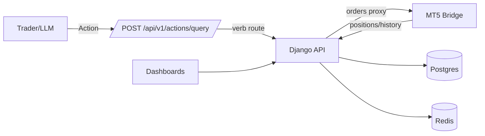

# Zanalytics Quant Platform

Trader‑first analytics, risk, and execution — backed by MT5, Django, Redis, Postgres, and Streamlit. Now with LLM‑native Actions and safe position control (partials, scaling, hedging).

For deeper architecture insights and API details, visit the [docs README](docs/README.md), the central hub for extended documentation.

## Table of Contents
- [What's Inside](#whats-inside)
- [Architecture](#architecture)
- [System Overview](#system-overview)
- [Getting Started – Quick Launch](#getting-started-quick-launch)
- [Environment Variables](#environment-variables)
- [MT5 service vs. Django API](#mt5-service-vs-django-api)
- [How It Works (Practical Flow)](#how-it-works-practical-flow)
- [Data Integrity and Deduplication](#data-integrity-and-deduplication)
- [MT5 Bridge & Orders (Execution)](#mt5-bridge-orders-execution)
- [Actions Bus for GPT (≤30 operations)](#actions-bus-for-gpt-30-operations)
- [Dashboards & Diagnostics](#dashboards-diagnostics)
- [Journaling (ZBAR)](#journaling-zbar)
- [Typical User Scenarios](#typical-user-scenarios)
- [Data Enrichment & Customization](#data-enrichment-customization)
- [Example .env Configuration](#example-env-configuration)
- [Security & Access Control](#security-access-control)
- [Contributing](#contributing)
- [Running Tests](#running-tests)
- [Known Issues & Best Practices](#known-issues-best-practices)
- [Future Directions & Next Steps](#future-directions-next-steps)

- [License (Strict, Non-Transferable)](#license-strict-non-transferable)
- [Advanced Usage](#advanced-usage)

- [License](#license)
- [Advanced Usage: Adding a New Dashboard](#advanced-usage-adding-a-new-dashboard)

- [Full API Documentation](#full-api-documentation)
- [FAQ](#faq)
- [Pulse Dashboard Prototype](#pulse-dashboard-prototype)
- [Exporting Streamlit Dashboards to WordPress](#exporting-streamlit-dashboards-to-wordpress)
- [Further Reading](#further-reading)

## What's Inside
- `backend/mt5`: Flask bridge to MetaTrader5 (send orders, partial close, hedge, scale)
- `backend/django`: REST API, Actions Bus router, positions aliases, journal
- `dashboard/`: Streamlit UI (Pulse, Whisperer, diagnostics)
- `openapi.actions.yaml`: the single schema to upload to Custom GPT
- `docs/`: deep dives (Actions Bus, Positions & Orders, Journaling schema)

## Architecture


## System Overview

The Zanalytics Quant platform is architected to meet the rigorous demands of professional quantitative research and trading. Each component has a distinct role designed to maximize security, modularity, and performance:

- **MT5** serves as the primary market data source and trading engine, running inside a Docker container with Wine to ensure consistent cross-platform operation. It exposes a REST API for data retrieval and order management, isolating the trading environment from other system components for security and stability.

- **Django API** acts as the orchestrator and backend service layer. It manages user authentication, enforces access controls, and provides RESTful endpoints for data retrieval and command execution. The API encapsulates business logic and database interactions, ensuring secure and auditable operations.

- **Redis** is leveraged as a high-performance in-memory cache and message bus. It stores real-time tick and bar data, event streams, and intermediate enrichment results to enable low-latency analytics and dashboard updates. Redis caching reduces load on the main database and supports real-time responsiveness.

- **Postgres** is the authoritative data store for all historical and enriched market data, including ticks, bars, positions, and computed features. It provides transactional integrity and supports complex queries required for backtesting and research.

- **Enrichment Scripts** located in the `utils/` directory perform data transformation, feature engineering, and batch ETL processes. They convert raw market data into actionable alpha features, rolling statistics, and signals, which are then persisted back to Postgres and cached in Redis.

- **Streamlit Dashboard** offers a user-friendly, interactive frontend for visualization and analysis. It consumes data from the Django API and Redis cache, presenting live and historical market insights with customizable charts and controls.

This modular design facilitates secure separation of concerns, easy extensibility for new features or data sources, and robust performance for professional quant workflows.

---

## Getting Started – Quick Launch

Before starting, install the core tooling: [Git](https://git-scm.com/book/en/v2/Getting-Started-Installing-Git), [Docker](https://docs.docker.com/get-docker/) and [Docker Compose](https://docs.docker.com/compose/install/). Optional dependencies include [Wine](https://wiki.winehq.org/Download) for the MT5 bridge on non-Windows hosts and [Traefik](https://doc.traefik.io/traefik/getting-started/install-traefik/) if you plan to use its routing features.

1. **Clone the repository and set up the environment:**
    ```bash
    git clone https://github.com/fotomash/zanalytics-quant.git
    cd zanalytics-quant
    cp .env.template .env  # Never commit secrets!
    cp backend/mt5/.env.example backend/mt5/.env
    ```

2. **Edit your `.env` and `backend/mt5/.env` files** with all required API keys, passwords, and connection strings. See
   [Environment Variables](#environment-variables) for a summary of the most important settings and
   [docs/env-reference.md](docs/env-reference.md) for the complete table.

3. **Build and start the platform:**
    ```bash
    docker network create traefik-public
    docker-compose build --no-cache
    docker-compose up -d
    ```

4. **Check all services:**
    ```bash
    docker-compose ps
    docker-compose logs dashboard
    docker-compose logs mt5
    ```

5. **Access the dashboards and APIs:**
    - **Streamlit Dashboard:**  
      Open `http://localhost:8501` or your mapped domain.
    - **MT5 API:**  
      Try `curl "$MT5_API_URL/ticks?symbol=EURUSD&limit=10"`
    - **Traefik Dashboard:**  
      Open `https://your-traefik-domain.com` (with HTTP auth)
    - **Django API (Swagger/ReDoc):**
      Open `/swagger/` and `/redoc/` endpoints.

---

## Environment Variables

Key variables to configure before launching:

- `CUSTOM_USER` and `PASSWORD` – MT5 account credentials.
- `MT5_API_URL` / `MT5_URL` – URLs for the MT5 bridge.
- `DJANGO_API_URL` and `DJANGO_API_PREFIX` – Django API endpoints.
- `DASH_METRICS_PATH` and `DASH_PROMPT_PATH` – dashboard configuration paths.
- `BRIDGE_TOKEN` – optional token sent as `X-Bridge-Token` header.
- `VNC_DOMAIN`, `TRAEFIK_DOMAIN`, `TRAEFIK_USERNAME`, `ACME_EMAIL` – domains and Traefik settings.
- `DJANGO_SECRET_KEY` – secret key for Django.

For the complete list of variables, see [docs/env-reference.md](docs/env-reference.md).

---

## MT5 service vs. Django API

The MT5 bridge hosts its own REST interface. Django exposes proxies for the MT5 history endpoints, but they simply forward to the MT5 service. To avoid confusion, always point history requests to `MT5_API_URL`.

```bash
curl "$MT5_API_URL/history_deals_get"
curl "$MT5_API_URL/history_orders_get"
```

Directly hitting `$DJANGO_API_URL/history_deals_get` or `$DJANGO_API_URL/history_orders_get` will proxy the call, but the upstream service is still the MT5 bridge.

See [backend/mt5/app/routes/history.py](backend/mt5/app/routes/history.py) for details.
## How It Works (Practical Flow)

Step-by-step data flow from MT5 to the dashboard. [Read more](docs/how_it_works.md).

---

## Data Integrity and Deduplication

Tick data is hashed with MD5 to prevent duplicates and ensure consistency. [Details](docs/md5_flow.md).

---

## MT5 Bridge & Orders (Execution)

Core endpoints handle market orders, partial closes, scaling, and hedging. See [docs/POSITIONS_AND_ORDERS.md](docs/POSITIONS_AND_ORDERS.md).

---

## Actions Bus for GPT (≤30 operations)

Single endpoint for GPT-driven verbs defined in `openapi.actions.yaml`. Deep dive in [docs/ACTIONS_BUS.md](docs/ACTIONS_BUS.md).

---

## Dashboards & Diagnostics

Streamlit pages under `dashboard/pages/` power Pulse, Whisperer, and diagnostics. `24_Trades_Diagnostics.py` compares closed trades, MT5 history, and open positions.

---

## Journaling (ZBAR)

Structured entries append via `/api/v1/journal/append`. Schema and guide in [docs/JOURNALING.md](docs/JOURNALING.md).

---

## Typical User Scenarios

Examples of real-time viewing, enrichment jobs, and troubleshooting. [docs/user_scenarios.md](docs/user_scenarios.md).

---

## Data Enrichment & Customization

Extend scripts in `utils/` to build custom features and dashboards. [Workflow](docs/data_enrichment_customization.md).

---

## Example .env Configuration

Sample settings are available in [docs/example-env.md](docs/example-env.md).

---

## Security & Access Control

- **Traefik reverse proxy** provides SSL and HTTP Basic Auth at entrypoints.
- All APIs require authentication and rate limits are applied.
- Data flows are segmented per Docker network for defense in depth.

---

## Contributing

This codebase is not open for external contributions. All changes are managed internally with strict audit and review.

---

## Running Tests

Commands for Django and analyzer suites are in [docs/running_tests.md](docs/running_tests.md).

---

## Known Issues & Best Practices

Current limitations and extension tips: [docs/known_issues_best_practices.md](docs/known_issues_best_practices.md).

---

## Future Directions & Next Steps

Planned improvements include live data ingestion, Redis-first caching, decoupled enrichment, and OAuth2 security. [Full roadmap](docs/future_directions.md).

---

## License

**All logic, infrastructure, dashboards, enrichment scripts, data models, and code are strictly proprietary and protected IP.**

Unauthorized use, distribution, or copying is prohibited and will be prosecuted.

This project is proprietary and provided under a strict, non-transferable license. See [LICENSE](LICENSE) for details.

---

## Advanced Usage

Add new Streamlit dashboards following [docs/advanced_dashboard.md](docs/advanced_dashboard.md).

---

## Full API Documentation

- **Swagger:** `/swagger/`
- **ReDoc:** `/redoc/`
- Generate Python module docs with:
  ```bash
  pdoc --html utils --output-dir docs/api
  ```

---

## FAQ

Common setup and operational questions live in [docs/faq.md](docs/faq.md).

**Q: Something isn’t working—how do I see detailed error logs?**
A: Use `docker-compose logs <service>` (add `-f` to follow in real time) or `docker logs <container>` for single containers. For service-specific errors, check Django's debug logs and MT5 bridge logs.

**Q: Can I run this without Docker?**
A: Not recommended. The MT5 and dashboard stack is designed for containerization for full reproducibility and security.

**Q: Where is my live data stored?**  
A: Real-time data is cached in Redis and long-term data is stored in Postgres. Snapshots/exports may use Parquet in `/data/`.

**Q: How can I add a new feature or signal?**  
A: Extend or edit the scripts in `utils/` and trigger the enrichment process.

**Q: What if the dashboard is blank?**
A: Double-check your API/DB containers, verify enrichment, and confirm `.env` credentials.


**Q: I receive errors about missing environment variables.**
A: Copy `.env.example` to `.env`, double-check the keys, and restart the containers after any updates.


**Q: The app can't connect to Postgres or Redis.**
A: Confirm your `.env` credentials, ensure the services are running (`docker ps`), and check container logs for authentication or network errors.

**Q: How do I clear cached data in Redis?**
A:
1. Run the following to flush all cached keys:
   ```bash
   docker-compose exec redis redis-cli FLUSHALL
   ```
2. Restart the services so caches repopulate with fresh data.

**Q: I need a clean database—how do I reset Postgres?**
A:
1. Stop the services:
   ```bash
   docker-compose down
   ```
2. Remove the Postgres volume (be sure you're ok losing all data):
   ```bash
   docker volume rm <name>  # or docker-compose down -v
   ```
3. Rerun migrations to recreate schema:
   ```bash
   docker-compose run django migrate
   ```
4. Restart the stack:
   ```bash
   docker-compose up -d
   ```

**Q: Docker containers fail to build/start.**
A:
1. Verify your Docker installation and version.
2. Rebuild images without cache using `docker-compose build --no-cache`.
3. Check container output with `docker-compose logs`.
4. Ensure required ports are free to avoid conflicts.

**Q: Docker containers complain about file or directory permissions.**
A: Verify host permissions on the affected paths. Run `sudo chown -R $USER:$USER <path>` or adjust with `chmod`, then rebuild the containers to apply the changes.

**Q: Startup fails with "address already in use."**
A: Another service is already bound to a required port.

1. Run `lsof -i :<port>` or `netstat -tulpn` to find the PID and service using the port.
2. Stop the offending process (`kill <PID>` or `systemctl stop <service>`).
3. Or edit the `ports:` mapping in `docker-compose.yml` to use a free port and restart the stack.

**Q: MCP silent or `curl` 404s, but logs are empty?**
A: The `pulse-kernel` service is likely hijacking port `8001`. Stop it and recreate the MCP container:

```bash
docker stop pulse-kernel tick-to-bar 2>/dev/null || true
docker compose up --force-recreate mcp
```

Then test the endpoint:

```bash
curl -k https://mcp1.zanalytics.app/mcp | head -3
```

You should see `{event: open...}`.

**Q: Install or build fails due to missing packages or version conflicts?**
A: Ensure you're using the supported Python version, then install dependencies with `poetry install` or `pip install -r requirements.txt`. If issues persist, clear cached wheels (e.g., `pip cache purge`) and try again.

**Q: The web UI won't compile or `npm start` fails.**
A: Remove the `web/node_modules` directory and reinstall dependencies with `npm install` (or `npm ci`). Ensure you're using the project's required Node.js version.


**Q: Celery tasks are stuck or failing—what should I do?**
A:
1. Check the Celery worker logs for errors.
2. Purge the queue:
   ```bash
   celery -A app purge -f
   ```
3. Restart the Celery service.
4. For a quick diagnostic, run [check_celery.sh](check_celery.sh).

**Q: How do I reset the containers when data gets corrupted or outdated?**
A:
1. Stop and remove containers and volumes: `docker-compose down -v`.
2. Remove any orphan containers: `docker container prune -f`.
3. Rebuild and start fresh containers: `docker-compose up --build`.
4. Rerun database migrations if applicable.


---

## Pulse Dashboard Prototype

Behavioral and risk analytics demo. [docs/pulse_dashboard_prototype.md](docs/pulse_dashboard_prototype.md).

---

## Exporting Streamlit Dashboards to WordPress

Static export workflow for publishing dashboards on WordPress. [docs/export_dashboards_wordpress.md](docs/export_dashboards_wordpress.md).

---

## Further Reading

- [Pulse README](README_PULSE.md)
- [Pulse Wyckoff Live README](PULSE_WYCKOFF_LIVE_README.md)
- [Documentation Hub](docs/README.md)
- [Pulse Integration Plan](PULSE_INTEGRATION_PLAN.md)
- [Stakeholder Update](ZANALYTICS_PULSE_STAKEHOLDER_UPDATE.md)
