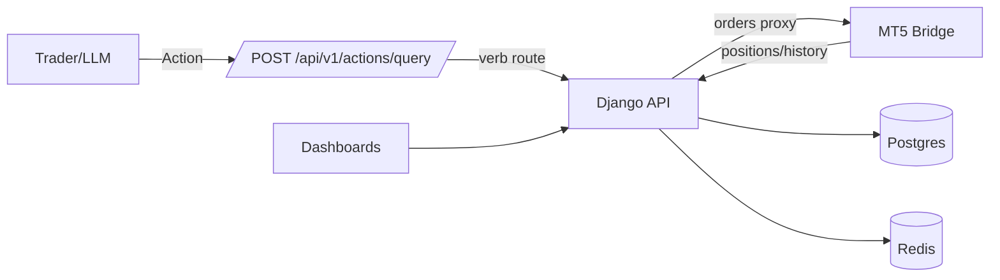

# Zanalytics Quant Platform

Trader‑first analytics, risk, and execution — backed by MT5, Django, Redis, Postgres, and Streamlit. Now with LLM‑native Actions and safe position control (partials, scaling, hedging).

Contents
- What’s Inside
- Quick Start
- MT5 service vs. Django API
- MT5 Bridge & Orders
- Positions (Partials, Hedge)
- Actions Bus for GPT (≤30 ops)
- Dashboards & Diagnostics
- Journaling (Schema)
- Troubleshooting

What’s Inside
- `backend/mt5`: Flask bridge to MetaTrader5 (send orders, partial close, hedge, scale)
- `backend/django`: REST API, Actions Bus router, positions aliases, journal
- `dashboard/`: Streamlit UI (Pulse, Whisperer, diagnostics)
- `openapi.actions.yaml`: the single schema to upload to Custom GPT
- `docs/`: deep dives (Actions Bus, Positions & Orders, Journaling schema)

Architecture


## System Overview

The Zanalytics Quant platform is architected to meet the rigorous demands of professional quantitative research and trading. Each component has a distinct role designed to maximize security, modularity, and performance:

- **MT5** serves as the primary market data source and trading engine, running inside a Docker container with Wine to ensure consistent cross-platform operation. It exposes a REST API for data retrieval and order management, isolating the trading environment from other system components for security and stability.

- **Django API** acts as the orchestrator and backend service layer. It manages user authentication, enforces access controls, and provides RESTful endpoints for data retrieval and command execution. The API encapsulates business logic and database interactions, ensuring secure and auditable operations.

- **Redis** is leveraged as a high-performance in-memory cache and message bus. It stores real-time tick and bar data, event streams, and intermediate enrichment results to enable low-latency analytics and dashboard updates. Redis caching reduces load on the main database and supports real-time responsiveness.

- **Postgres** is the authoritative data store for all historical and enriched market data, including ticks, bars, positions, and computed features. It provides transactional integrity and supports complex queries required for backtesting and research.

- **Enrichment Scripts** located in the `utils/` directory perform data transformation, feature engineering, and batch ETL processes. They convert raw market data into actionable alpha features, rolling statistics, and signals, which are then persisted back to Postgres and cached in Redis.

- **Streamlit Dashboard** offers a user-friendly, interactive frontend for visualization and analysis. It consumes data from the Django API and Redis cache, presenting live and historical market insights with customizable charts and controls.

This modular design facilitates secure separation of concerns, easy extensibility for new features or data sources, and robust performance for professional quant workflows.

---

## Getting Started – Quick Launch

1. **Clone the repository and set up the environment:**
    ```bash
    git clone https://github.com/fotomash/zanalytics-quant.git
    cd zanalytics-quant
    cp .env.example .env  # Never commit secrets!
    cp backend/mt5/.env.example backend/mt5/.env
    ```

2. **Edit your `.env` and `backend/mt5/.env` files** with all required API keys, passwords, and connection strings.
   You need:
    - All database credentials
    - Redis settings
    - Domain names for Traefik routing
    - MT5 and Django/Flask endpoints

3. **Build and start the platform:**
    ```bash
    docker network create traefik-public
    docker-compose build --no-cache
    docker-compose up -d
    ```

4. **Check all services:**
    ```bash
    docker-compose ps
    docker-compose logs dashboard
    docker-compose logs mt5
    ```

5. **Access the dashboards and APIs:**
    - **Streamlit Dashboard:**  
      Open `http://localhost:8501` or your mapped domain.
    - **MT5 API:**  
      Try `curl "$MT5_API_URL/ticks?symbol=EURUSD&limit=10"`
    - **Traefik Dashboard:**  
      Open `https://your-traefik-domain.com` (with HTTP auth)
    - **Django API (Swagger/ReDoc):**  
      Open `/swagger/` and `/redoc/` endpoints.

---

- `CUSTOM_USER`: Username for accessing the MT5 service.
- `PASSWORD`: Password for the custom user.
- `VNC_DOMAIN`: Domain for accessing the VNC service.
- `TRAEFIK_DOMAIN`: Domain for Traefik dashboard.
- `TRAEFIK_USERNAME`: Username for Traefik basic authentication.
- `ACME_EMAIL`: Email address for Let's Encrypt notifications.
- `MT5_API_URL`: Base URL where the MT5 service is available (default `http://mt5:5001`).
- `MT5_URL`: Direct MT5 bridge URL used by dashboards (default `http://mt5:5001`).
- `DJANGO_API_URL`: Base URL of the Django API service (default `http://django:8000`).
- `DJANGO_API_PREFIX`: Path prefix for all Django API endpoints (default `/api/v1`).
- `DASH_METRICS_PATH`: Path to dashboard metrics configuration (default `dashboard/config/dashboard_metrics_summary.yaml`).
- `DASH_PROMPT_PATH`: Path to dashboard prompt template (default `dashboard/config/dashboard_prompt.txt`).
- `BRIDGE_TOKEN` *(optional)*: Token sent as `X-Bridge-Token` header to the MT5 bridge.
- `DJANGO_SECRET_KEY`: your-secret


## MT5 service vs. Django API

The MT5 bridge hosts its own REST interface. Django exposes proxies for the MT5 history endpoints, but they simply forward to the MT5 service. To avoid confusion, always point history requests to `MT5_API_URL`.

```bash
curl "$MT5_API_URL/history_deals_get"
curl "$MT5_API_URL/history_orders_get"
```

Directly hitting `$DJANGO_API_URL/history_deals_get` or `$DJANGO_API_URL/history_orders_get` will proxy the call, but the upstream service is still the MT5 bridge.

See [backend/mt5/app/routes/history.py](backend/mt5/app/routes/history.py) for details.


## How It Works (Practical Flow)

### 1. **Data Pipeline**
- **MT5** runs inside Docker (with Wine if on Linux/Mac) and streams live tick/bar/position/order data via REST API.
- **Django/Flask** container handles user authentication, business logic, and all database ops.
- **Enrichment Scripts** (in `utils/`) transform raw market data into alpha features, rolling stats, signals, and are responsible for ETL (Extract, Transform, Load).
- **Postgres** stores all historical and enriched market data.
- **Redis** is used for real-time, super-fast caching (e.g. tickers, rolling windows).
- **Streamlit Dashboard** presents analytics and charts, pulling live from APIs or historical DB/Parquet as configured.

---

## Data Integrity and Deduplication: MD5 Flow

To ensure data integrity and prevent duplication of tick data, the platform employs an MD5 hashing mechanism as part of its enrichment and caching workflow. Each incoming tick is serialized and hashed using MD5, producing a unique fingerprint that represents the tick's content.

This MD5 hash is then used within the enrichment scripts (notably within components like `TickVectorizer`) to detect duplicate ticks before insertion into the database or cache. By comparing incoming tick hashes against existing entries in Redis or Postgres, the system avoids redundant processing and storage, which is critical for maintaining accurate real-time analytics.

This approach improves both data quality and system efficiency, ensuring that dashboards and APIs reflect consistent, deduplicated market data streams.

---

## MT5 Bridge & Orders (Execution)

- Bridge (Flask) provides:
  - `POST /send_market_order` (type: BUY/SELL)
  - `POST /partial_close_v2` (fraction or absolute volume)
  - `POST /scale_position` (increase size)
  - `POST /hedge` (opposite side; nets on netting accounts)
- Django proxies:
  - `POST /api/v1/orders/market | modify | close`
  - Friendly aliases: `POST /api/v1/positions/close | modify | hedge`

Deep dive: `docs/POSITIONS_AND_ORDERS.md`

---

## Actions Bus for GPT (≤30 operations)

- Upload schema: `openapi.actions.yaml`
- Single endpoint: `POST /api/v1/actions/query`
- Put verbs in body: `{ "type": "position_close", "payload": { ... } }`
- Router: `ActionsQueryView.post()` maps verbs to existing views.

Deep dive: `docs/ACTIONS_BUS.md`

---

## Dashboards & Diagnostics

- Streamlit pages under `dashboard/pages/` (Pulse, Whisperer, Pro).
- Diagnostics: `24_Trades_Diagnostics.py` shows closed trades (DB), MT5 history, and open positions.

---

## Journaling (ZBAR)

- Structured entries are appended via `/api/v1/journal/append` from positions views.
- JSON Schema: `docs/schemas/journal_entry.schema.json`
- Guide: `docs/JOURNALING.md`

---

## Typical User Scenarios

### a) **Viewing Real-time Market Data**
- Login to your Streamlit dashboard.
- Choose the market or instrument (e.g. EURUSD, GBPUSD, DXY).
- See live tick charts, rolling bars, and indicator overlays.
- Historical data is automatically loaded from Postgres or Parquet (as configured).

### b) **Running Enrichment/Bulk Sync**
- To refresh features or add new data:
    ```bash
    docker exec -it dashboard bash
    python utils/enrich_features.py  # Or your enrichment script
    ```
- These scripts typically fetch new ticks/bars, calculate rolling stats (SMA, RSI, etc), and push back to Postgres or Redis.

### c) **API Data Access**
- Pull ticks:
    ```bash
    curl "$MT5_API_URL/ticks?symbol=GBPUSD&limit=50"
    ```
- Pull bars:
    ```bash
    curl "$MT5_API_URL/bars/EURUSD/M5?limit=200"
    ```
- Pull enriched features via Django API:
    ```bash
    curl "$DJANGO_API_URL/api/v1/enriched/?symbol=USDJPY"
    ```
- Filter ticks or bars by time range using the Django API:
    ```bash
    curl "$DJANGO_API_URL/api/v1/ticks/?symbol=EURUSD&time_after=2024-01-01T00:00:00Z&time_before=2024-01-01T12:00:00Z"
    curl "$DJANGO_API_URL/api/v1/bars/?symbol=EURUSD&timeframe=M5&time_after=2024-01-01T00:00:00Z"
    ```

### d) **Troubleshooting**
- Dashboard blank?  
  Check the API/DB container logs, ensure enrichment is running, and verify `.env` secrets.
- MT5 error?  
  Make sure Wine is running and your license/user is set in the `.env`.

---

## Data Enrichment & Customization

- **Modify or extend enrichment scripts** in `utils/` to calculate your own custom features.
- Run enrichment as a scheduled job, via cron, or as a service container.
- You can create new dashboards by adding new `.py` files in the `dashboard/` folder and referencing new data sources (DB, Redis, Parquet).

### Example Enrichment Workflow

A typical enrichment workflow begins with raw tick data streamed from MT5 or loaded from CSV/Parquet snapshots. Each tick is processed by enrichment scripts in `utils/` which perform the following steps:

1. **Transformation:** The raw tick is parsed and normalized (e.g., timestamp conversion, price adjustments).
2. **Hashing:** The tick is hashed with MD5 to detect duplicates.
3. **Storage:** Unique ticks are inserted into Postgres for long-term storage and cached in Redis for fast access.
4. **Feature Generation:** Ticks are resampled into OHLC bars using `pandas.resample` and rolling statistics or indicators (SMA, RSI, etc.) are computed over the resulting bar data.
5. **Caching:** Computed features are cached in Redis to support low-latency dashboard queries.
6. **Visualization:** The Streamlit dashboard fetches enriched data from the Django API, which queries both Postgres and Redis, to render charts and analytics in near real-time.

This pipeline ensures that enriched data remains consistent, performant, and extensible for custom quant research.

---

## Example .env Configuration (Partial)

```env
# Platform credentials
CUSTOM_USER=your_user
PASSWORD=super_secret_password

# MT5 and API endpoints
MT5_URL=http://mt5:5001
MT5_API_URL=http://mt5:5001
DJANGO_API_URL=http://django:8000
DJANGO_API_PREFIX=/api/v1
BRIDGE_TOKEN=

# Dashboard config
DASH_METRICS_PATH=dashboard/config/dashboard_metrics_summary.yaml
DASH_PROMPT_PATH=dashboard/config/dashboard_prompt.txt

# Database config
POSTGRES_HOST=postgres
POSTGRES_PORT=5432
POSTGRES_USER=postgres
POSTGRES_PASSWORD=postgres
POSTGRES_DB=zanalytics

# Redis config
REDIS_HOST=redis
REDIS_PORT=6379

# Traefik/SSL/Domains
VNC_DOMAIN=your-vnc-domain.com
TRAEFIK_DOMAIN=your-traefik-domain.com
TRAEFIK_USERNAME=admin
ACME_EMAIL=your@email.com
```
> *Never check in your production .env or real keys!*

---

## Security & Access Control

- **Traefik reverse proxy** provides SSL and HTTP Basic Auth at entrypoints.
- All APIs require authentication and rate limits are applied.
- Data flows are segmented per Docker network for defense in depth.

---

## Contributing

This codebase is not open for external contributions.
All changes are managed internally, with strict audit and review.

---

## Running Tests

To execute the automated Django test suite:

```bash
pip install -r backend/django/requirements.txt
export DJANGO_SECRET_KEY=test-secret
pytest
```

Tests run against the lightweight SQLite database defined in
`backend/django/app/test_settings.py`.

### Analyzer Tests

The confluence analyzers combine Wyckoff pattern detection and Smart Money Concepts
features. After installing dependencies with `pip install -r requirements.txt`,
run the dedicated tests:

```bash
pytest tests/test_analyzers.py
```

---

## Known Issues & Best Practices

### Known Issues
- **Environment Handling:** Care must be taken to secure `.env` files and avoid committing secrets to version control.
- **Error Handling:** Some enrichment scripts may require improved exception management for robustness, especially with live data streams.
- **Modularity:** While modular, some components have implicit dependencies that should be documented and refactored over time.

### Best Practices for Extension
- Always include comprehensive docstrings for new scripts and functions.
- Document any new API endpoints with clear schema definitions.
- Avoid hardcoding secrets or credentials; use environment variables exclusively.
- Follow existing code style and architectural patterns to maintain consistency.
- Test new features thoroughly in isolated environments before deployment.

---

## Future Directions & Next Steps

We plan to enhance the platform with the following improvements:

- **Live Data Ingestion:** Streamline MT5 data ingestion to support higher throughput and lower latency.
- **Redis-first Caching:** Shift more data queries to Redis for real-time responsiveness, reducing Postgres load.
- **Decoupling Enrichment:** Separate enrichment pipelines from the dashboard layer to allow independent scaling and scheduling.
- **Enhanced API Security:** Implement OAuth2 and token-based authentication for finer-grained access control and auditability.

These steps aim to improve scalability, security, and flexibility for professional quant workflows.

---

## License (Strict, Non-Transferable)

**All logic, infrastructure, dashboards, enrichment scripts, data models, and code are strictly proprietary and protected IP.**  
Unauthorized use, distribution, or copying is prohibited and will be prosecuted.

---

## Advanced Usage: Adding a New Dashboard

1. **Create a new Python file** in `dashboard/` (e.g. `CustomDashboard.py`).
2. **Import data** from the Django API, Redis, or load a Parquet snapshot.
3. **Add custom Streamlit widgets, charts, or analytics.**
4. **Mount in Docker, rebuild, and access from the dashboard UI.

---

## Full API Documentation

- **Swagger:** `/swagger/`
- **ReDoc:** `/redoc/`

> Note: The Swagger and ReDoc endpoints may not be present in all deployments depending on configuration. If these are not exposed, you can generate API documentation locally using Django REST Framework's built-in schema generation tools or third-party packages such as `drf-yasg` or `pdoc`.  
>  
> API endpoints require authentication and are accessible only to authorized users. Ensure your credentials and tokens are properly configured before making requests.

- **Python module docs:**  
  Generate with pdoc:
    ```bash
    pdoc --html utils --output-dir docs/api
    ```

- **Enrichment API and scripts:**  
  Document your scripts with docstrings for easier internal use.

---

## FAQ

**Q: Can I run this without Docker?**  
A: Not recommended. The MT5 and dashboard stack is designed for containerization for full reproducibility and security.

**Q: Where is my live data stored?**  
A: Real-time data is cached in Redis and long-term data is stored in Postgres. Snapshots/exports may use Parquet in `/data/`.

**Q: How can I add a new feature or signal?**  
A: Extend or edit the scripts in `utils/` and trigger the enrichment process.

**Q: What if the dashboard is blank?**  
A: Double-check your API/DB containers, verify enrichment, and confirm `.env` credentials.

---

Let me know if you want even deeper detail—*e.g.*, specific API endpoint schemas, more onboarding workflows, or internal architecture diagrams.


## Pulse Dashboard Prototype

A lightweight Streamlit interface for behavioral and risk analytics.

### Quick start
```bash
pip install -r requirements.txt
streamlit run pulse_dashboard.py
```

The app reads configuration from `pulse_dashboard_config.yaml` and mock trade data from `trade_history.json`.

## Further Reading

- [Pulse README](README_PULSE.md)
- [Pulse Wyckoff Live README](PULSE_WYCKOFF_LIVE_README.md)
- [Documentation Hub](docs/README.md)
- [Pulse Integration Plan](PULSE_INTEGRATION_PLAN.md)
- [Stakeholder Update](ZANALYTICS_PULSE_STAKEHOLDER_UPDATE.md)
