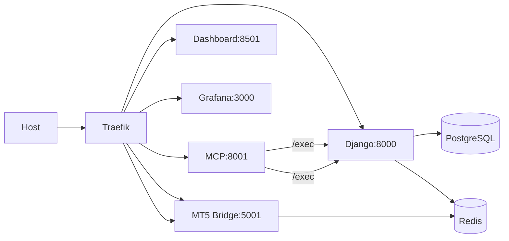

# Architecture

## Network Routing

The diagram below shows external traffic flowing from the host through Traefik to internal services
and data stores. It highlights the MCP `/exec` flow to Django as well as connections to PostgreSQL,
Redis, and the MT5 bridge.

Traefik also routes requests to the Streamlit info site on port `8501`; see [streamlit.md](streamlit.md) for details.

For a memory-centric view of the platform, see [architecture_v2.1beta.md](architecture_v2.1beta.md). The legacy dual-stream approach remains documented in [architecture_pulse_streaming.md](architecture_pulse_streaming.md).

## Monitoring

For metrics collection, dashboards, and alerts, see [monitoring.md](monitoring.md).

## MCP2 Role

MCP2 brokers `/exec` commands from external clients to the Django API. It handles authentication, forwards requests, and mediates approvals for operations that modify state.

## Redis, Kafka, and Postgres Topology

Redis still provides the in-memory event bus and cache for ticks, bars, and other ephemeral session data. Kafka now backs the durable, replayable journal stream used for historical recovery and cross-service analytics. Postgres stores long-lived records such as positions, journal entries, and enrichment results. Django consumes from both Redis and Kafka, while the MT5 bridge publishes market data into Redis for low-latency dashboards and into Kafka for durability. The [`utils/mt5_ingest.py`](../utils/mt5_ingest.py) helper streams live ticks directly to Kafka so every market event is journaled for later replay.

Kafka's ordered log underpins deterministic replay. Services can rebuild state by reading the tick stream in order, producing the exact sequence observed live, while Redis continues to serve as the high-speed bus for current sessions.

## Multi-Stream Architecture

The platform has moved beyond the single Redis stream. Real-time data is written to Redis for fast reads while Kafka captures the same events for replay and downstream processing. MCP2 coordinates across these streams to support concurrent feeds and smoother failover. See [architecture_pulse_streaming.md](architecture_pulse_streaming.md) for a deeper dive into the older dual-stream model.

