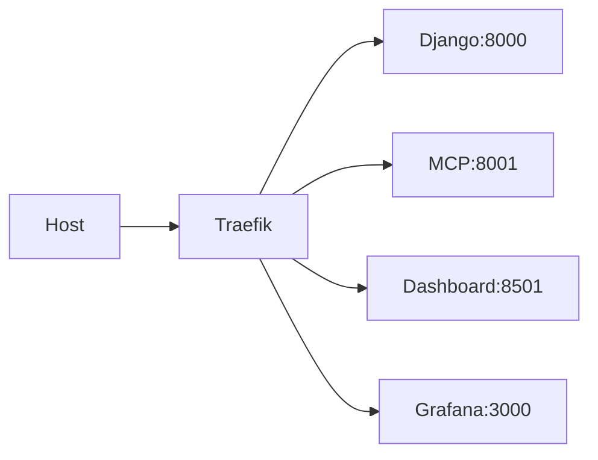

# Architecture

## Network Routing

The diagram below shows external traffic flowing from the host through Traefik to internal services.

```mermaid
graph LR
    host[Host] --> traefik[Traefik]
    traefik --> django[Django:8000]
    traefik --> mcp[MCP:8001]
    traefik --> dashboard[Dashboard:8501]
    traefik --> grafana[Grafana:3000]
```

