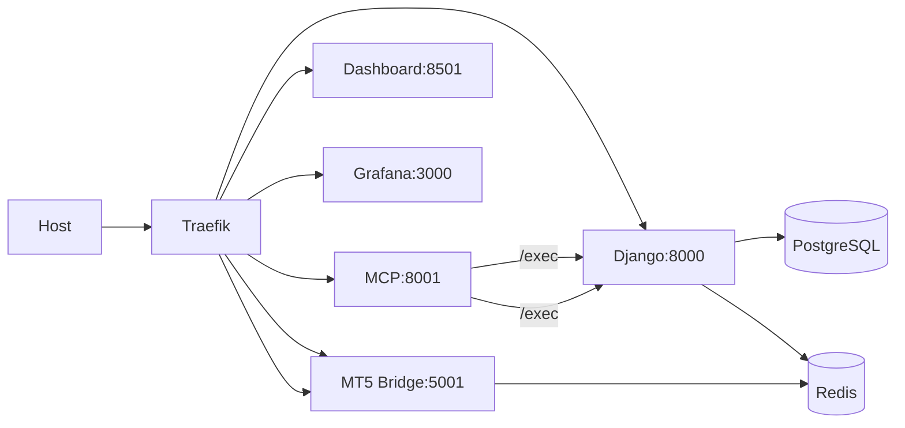

# Architecture

## Network Routing

The diagram below shows external traffic flowing from the host through Traefik to internal services
and data stores. It highlights the MCP `/exec` flow to Django as well as connections to PostgreSQL,
Redis, and the MT5 bridge.

The diagram below shows external traffic flowing from the host through Traefik to internal services and their data stores. It also highlights the `/exec` call from the MCP service into Django.

