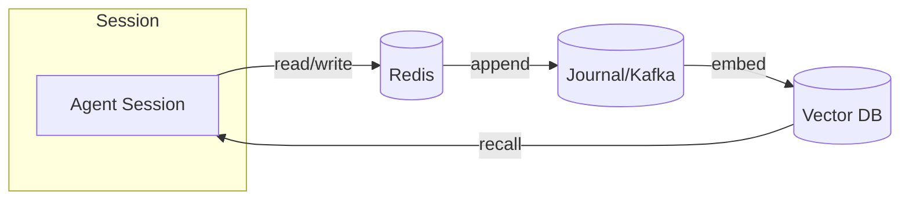

# LLM Memory Flow

Describes how session context moves between Redis, the journal/Kafka, and vector storage.

## Memory Layers

- **Redis (working memory)** – holds the most recent ticks, messages, and session state for millisecond access.
- **Journal/Kafka (durable memory)** – every envelope is appended to a replayable log for audit and recovery.
- **Vector DB (semantic recall)** – embeddings of snapshots enable long‑term retrieval and relevance scoring.

## Flow Example

When an agent handles a request:

1. The request and intermediate results are written to Redis.
2. The same event is appended to the Kafka‑backed journal.
3. A snapshot of the state is embedded and stored in the vector database.
4. Later prompts pull recent context from Redis and relevant vectors for enriched responses.

For broader architectural context see [architecture_v2.1beta.md](architecture_v2.1beta.md).
